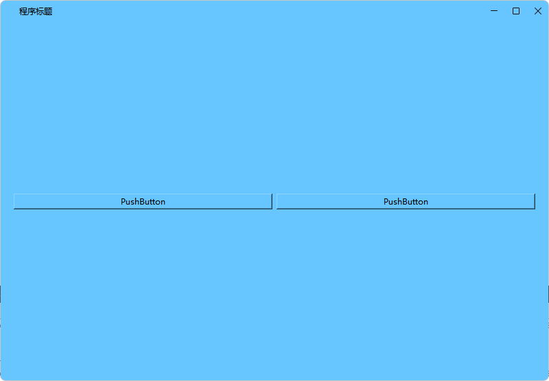
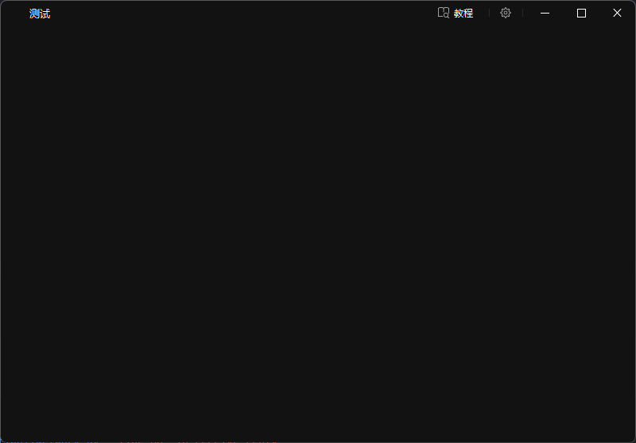

# C++qt的无边框窗口
无边框代码来源于[JiuZhouCangLan/QtFrameLessWindow](https://github.com/JiuZhouCangLan/QtFrameLessWindow),我在其基础上添加了可继承标题栏的基类，在开发中经常会创建多个窗口，可使用此基类直接创建。

支持图标、标题和自定义QWidget，标题栏透明背景色，占用32像素，使用Qt设计师设计页面时，建议在上方保留32像素空间

经测试：DPI在100%和150%时无任何问题

双屏幕测试也没有问题

目前Bug：双击标题栏最大化后，在点击最大化按钮，窗口最大化无法复原，双击和按钮不混用则没有问题

基本满足项目的使用

示例：

